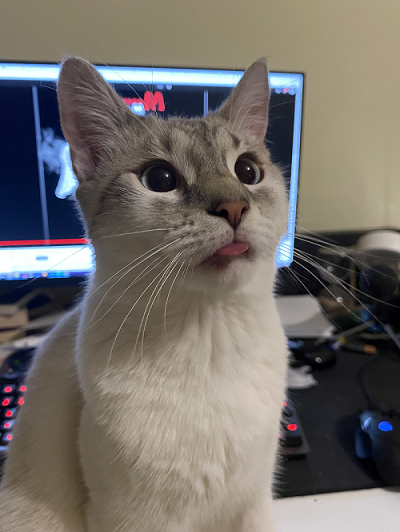
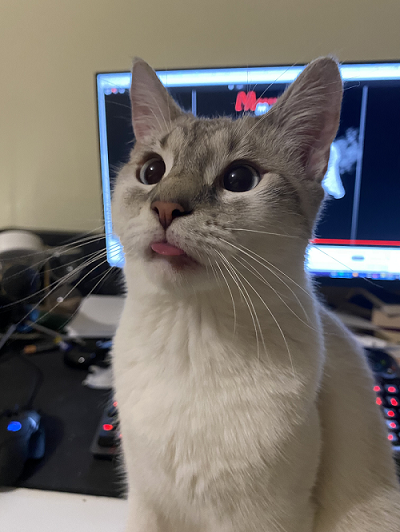
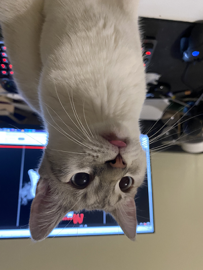
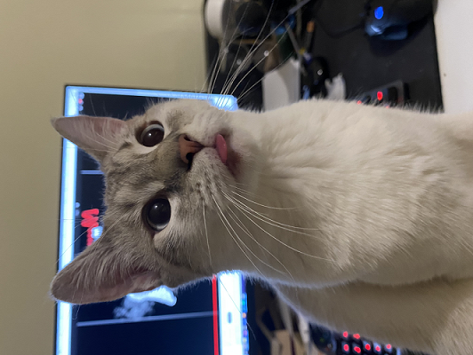
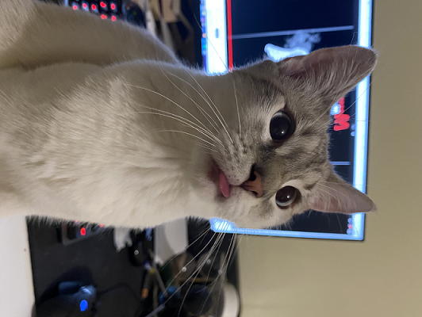
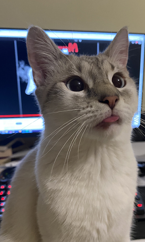
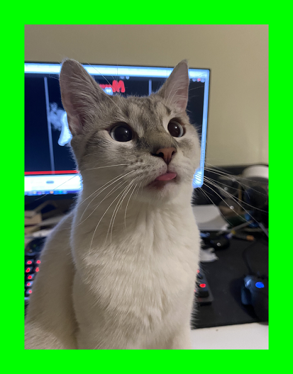
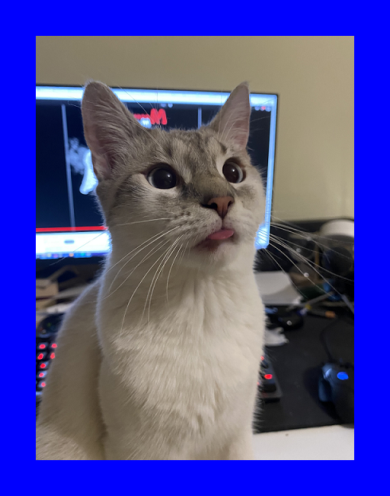
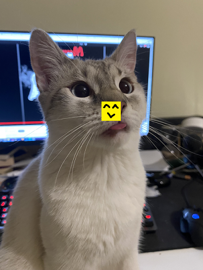
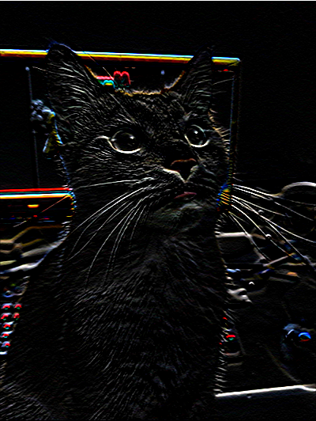

# Image Editor

This project is an image processing application written in C. It allows users to perform various operations on images such as loading, saving, flipping, rotating, cropping, extending, pasting, and applying filters. The application supports BMP images and provides a command-line interface for interacting with the images.

## Table of Contents
- [Getting Started](#getting-started)
- [Prerequisites](#prerequisites)
- [Building the Project](#building-the-project)
- [Running the Application](#running-the-application)
- [Usage](#usage)
- [Commands](#commands)
- [File Descriptions](#file-descriptions)
- [Memory Management](#memory-management)
- [Testing the Application](#testing-the-application)

## Getting Started

Follow these instructions to get a copy of the project up and running on your local machine.

### Prerequisites

You need to have the following software installed on your machine:
- GCC (GNU Compiler Collection)
- Make

### Building the Project

To build the project, navigate to the project directory and run:

```bash
make build
```
This will compile the source files and create an executable named **main**.

### Running the Application

To run the application, use:

```bash
make run
```
This will execute the compiled program. You can also run the executable directly:

```bash
./main
```

***To simultaneously build and run the project you can simply run:***

```bash
make
```

## Usage 

Upon running the application, you will be prompted with a list of commands that you can use to manipulate images. Enter the commands as described in the Commands section to perform different image processing operations.

### Commands

The application provides a set of commands that can be used to manipulate images. Below is a list of available commands:

| Command Name |        Parameters       |                        Description                        |
|--------------|-------------------------|-----------------------------------------------------------|
|      `e`     |            -            | Exit - closes the program                                |
|      `l`     |         `N M path`      | Load - loads an image of size NxM from the given path    |
|      `s`     |        `index path`     | Save - saves the image from the index at the specified path |
|     `ah`     |          `index`        | Apply Horizontal Flip - applies the horizontal flip operation to the image at the given index |
|     `av`     |          `index`        | Apply Vertical Flip - applies the vertical flip operation to the image at the given index |
|     `arl`    |          `index`        | Apply Rotate Left - rotates the image at the given index to the left |
|     `arr`    |          `index`        | Apply Rotate Right - rotates the image at the given index to the right |
|      `ac`    | `index x y width height`| Apply Crop - applies the crop operation with the given parameters to the image at the given index |
|      `ae`    | `index rows cols R G B` | Apply Extend - applies the extend operation with the given parameters to the image at the given index |
|      `ap`    | `index_dst index_src x y`| Apply Paste - applies the paste operation with the given parameters to the image at the index_dst |
|      `cf`    |  `size [list of values]`| Create Filter - creates a filter of the given size with the given list of values (example: if creating a filter of size 3, then 9 values will follow size) |
|      `af`    |  `index_img index_filter`| Apply Filter - applies the filter from index_filter to the image at index_img |
|      `df`    |       `index_filter`    | Delete Filter - deletes the filter from index_filter     |
|      `di`    |        `index_img`      | Delete Image - deletes the image from index_img          |

## File Descriptions

### main.c

The main file that contains the entry point of the application and the main command processing loop. It interacts with the user, processes commands, and manages images and filters.

Key Functions:

- **main**(): *The main function where command processing occurs.*

### imageprocessing.c

Contains functions for various image processing operations.

Key Functions:

For reference, this is the original image:

<p style="text-align: center;">
    
</p>

- **alloc_mat**(int height, int width): *Allocates memory for an image matrix.*
- **free_mat**(int ***mat, int height, int width): *Frees the allocated memory for an image matrix.*
- **flip_horizontal**(int ***image, int height, int width): *Flips an image horizontally.*

<p style="text-align: center;">
    
</p>

- **flip_vertical**(int ***image, int height, int width): *Flips an image vertically.*

<p style="text-align: center;">
    
</p>

- **rotate_left**(int ***image, int height, int width): *Rotates an image 90 degrees to the left.*

<p style="text-align: center;">
    
</p>

- **rotate_right**(int ***image, int height, int width): *Rotates an image 90 degrees to the right.*

<p style="text-align: center;">
    
</p>

- **crop**(int ***image, int height, int width, int x, int y, int new_height, int new_width): *Crops an image.*

<p style="text-align: center;">
    
</p>

- **extend**(int ***image, int height, int width, int extend_rows, int extend_cols, int rgb_R, int rgb_G, int rgb_B): *Extends an image with the specified color.*

<p style="text-align: center;">
    
    
</p>

- **paste**(int ***dst, int dst_height, int dst_width, int ***src, int src_height, int src_width, int x, int y): *Pastes one image onto another.*

<p style="text-align: center;">
    
</p>

- **apply_filter**(int ***image, int height, int width, float **filter, int filter_size): *Applies a filter to an image.*

<p style="text-align: center;">
    
    
</p>

### bmp.c
Handles loading and saving of BMP images.

Key functions:

- **read_from_bmp**(int ***image, int height, int width, const char *path): *Reads an image from a BMP file.*
- **write_to_bmp**(int ***image, int height, int width, const char *path): *Writes an image to a BMP file.*

### ux.c
Provides a function to print the list of available commands.

Key Functions:

- **print_commands**(): *Prints a formatted list of commands and their descriptions to the console.*

### Makefile
A makefile that provides build automation. It includes targets for building the project, running the application, and cleaning up the build artifacts.

## Memory Management
The application dynamically allocates memory for images and filters. It is crucial to free this memory to avoid memory leaks. The **main.c** file includes proper memory management to ensure that all allocated memory is freed before exiting the program.

## Testing the Application

For testing purposes, the **images** directory contains 5 bmp files to use as input.

| File  | Height | Width |
|-------|--------|-------|
| cat   |  532   |  400  |
| cats  |  789   |  1024 |
| dog   |  432   |  400  |
| f1    |  186   |  500  |
| small |   38   |   38  |
